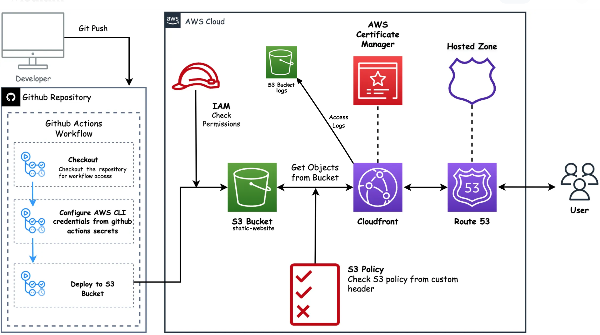

# 🚀 GitHub Pages to AWS Static Website Hosting

This project documents the migration of my personal static website from GitHub Pages to AWS. The goal was to gain hands-on experience using core AWS services to build a scalable, secure, and production-ready hosting environment.

---

## 🧰 Tech Stack & Services Used

- **Amazon S3** – For static website hosting and file storage
- **Amazon CloudFront** – As a global CDN for performance and HTTPS support
- **Amazon Route 53** – For domain name registration and DNS management
- **AWS Certificate Manager (ACM)** – For free SSL/TLS certificates
- **AWS IAM** – For access control and secure deployments
- **GitHub + GitHub Actions** *(optional)* – For version control and future CI/CD integration
- **AWS CLI** – To manage AWS resources and automate deployments

---

## 🗺️ Architecture Overview

## 📘 Full Step-by-Step Guide

➡️ [Click here to view the full implementation guide](./IMPLEMENTATION.md)

---

## ✅ Result

- **Live Site:** https://www.KevinnRamirez.com
- Fully served through AWS with HTTPS and custom domain